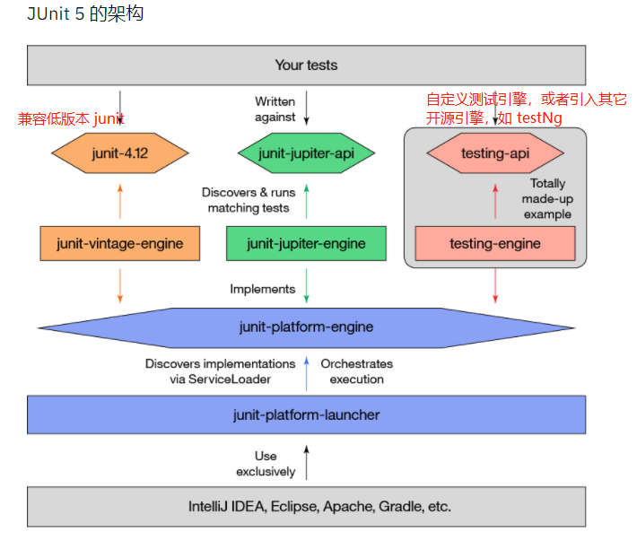

---
 高效的单元测试


## 工程结构  ![badge-jdk-8] ![badge-junit-platform] ![badge-junit-jupiter] ![badge-junit-vintage]

```
src
├── pom       // parent 
├── lucky-middleware-mock   // ignore
├── lucky-test-tool（fastjunit）         // 【fastjunit 核心主体】
    |-- annotation
    |-- data                // 数据提供方法
    |-- H2                  // 内存数据库封装方法
    |-- extend              // junit5 自定义的 ExtendWith
    |-- runner              // ExtendWith 的集合
    |-- utils          
├── lucky-test-demo         // 引用 fastjunit 并编写的 demo，如果一些依赖库下载不到可以自行去除      
├── lucky-testng-engine    // testNg 兼容 junit5 的引擎 
```

- **使用文档：** https://luckycoffee.github.io/docs/


采用 JUnit5 做为基础框架的原因

```JUnit 5 = JUnit Platform + JUnit Jupiter + JUnit Vintage```
- JUnit 5是一个模块化和可扩展的测试框架，支持Java 8及更高版本。
- JUnit 5由三个部分组成——一个基础平台、一个新的编程和扩展模型Jupiter，以及一个名为Vintage的向后兼容的测试引擎。
- JUnit 5 Jupiter的扩展模型可用于向JUnit中添加自定义功能。
- 扩展模型API测试生命周期提供了钩子和注入自定义参数的方法（即依赖注入）

JUnit5 带来了一个强大的扩展模型。扩展开发人员可以使用这个新模型向JUnit 5中添加自定义功能。



- [junit5](https://junit.org/junit5/docs/current/user-guide/)
- [JUnit 社区收集的一些第三方插件](https://github.com/junit-team/junit5/wiki/Third-party-Extensions)
- [IBM Junit5 博客](https://developer.ibm.com/zh/tutorials/j-introducing-junit5-part1-jupiter-api/#N10191)
- [实现 Junit5 引擎的 testNg](https://github.com/testng-team/testng-junit5)

## 开发规范 ##
- IDEA 安装阿里巴巴的代码检测插件，上传前代码分析下：**Alibaba Java Coding Guide**


## 开发计划 ##


## 发布日志 ##

[v1.0.0-beta - 2020/09/21](./docs/releases/v0.1.0.md)


## 文档

https://luckycoffee.github.io/docs/

## 快速开始 ##
- JDK 8
- IDEA 需要安装 Lombok


## FAQ ##


## 欢迎贡献


<div>
<table>
  <tbody>
  <tr></tr>
    <tr>
      <td align="center"  valign="middle">
        <a href="" target="_blank">
          
        </a>
      </td>
      <td align="center"  valign="middle">
        <a href="" target="_blank">
          
        </a>
      </td>
      <td align="center"  valign="middle">
        <a href="" target="_blank">
          
        </a>
      </td>
      <td align="center"  valign="middle">
        <a href="https://github.com/mosn" target="_blank">
          
        </a>
      </td>
    </tr>
    <tr></tr>
  </tbody>
</table>
</div>

## 参考资料

- [junit5](https://junit.org/junit5/docs/current/user-guide/)


[badge-jdk-8]: https://img.shields.io/badge/jdk-8-lightgray.svg "JDK-8"
[badge-junit-platform]: https://img.shields.io/badge/junit-platform-brightgreen.svg "JUnit Platform"
[badge-junit-jupiter]: https://img.shields.io/badge/junit-jupiter-green.svg "JUnit Jupiter Engine"
[badge-junit-vintage]: https://img.shields.io/badge/junit-vintage-yellowgreen.svg "JUnit Vintage Engine"
